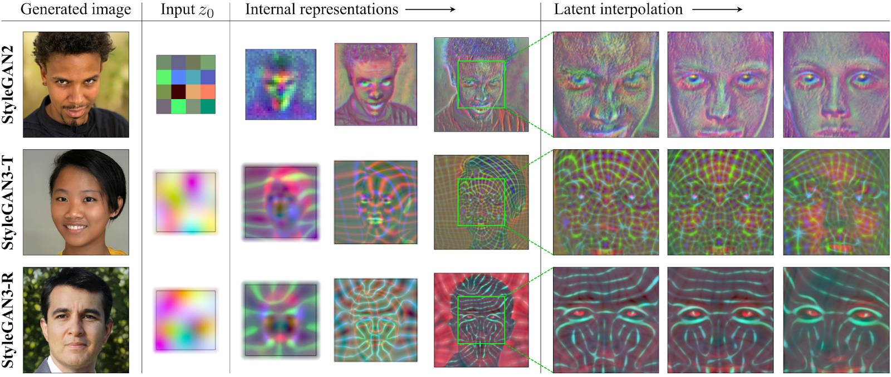
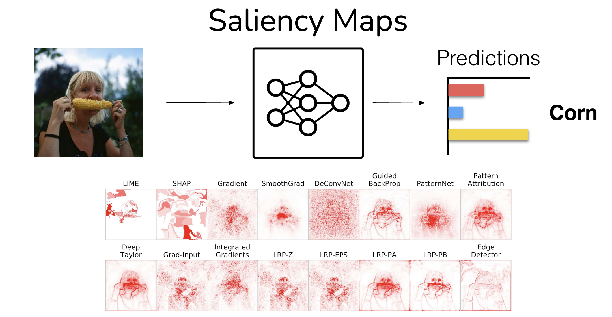
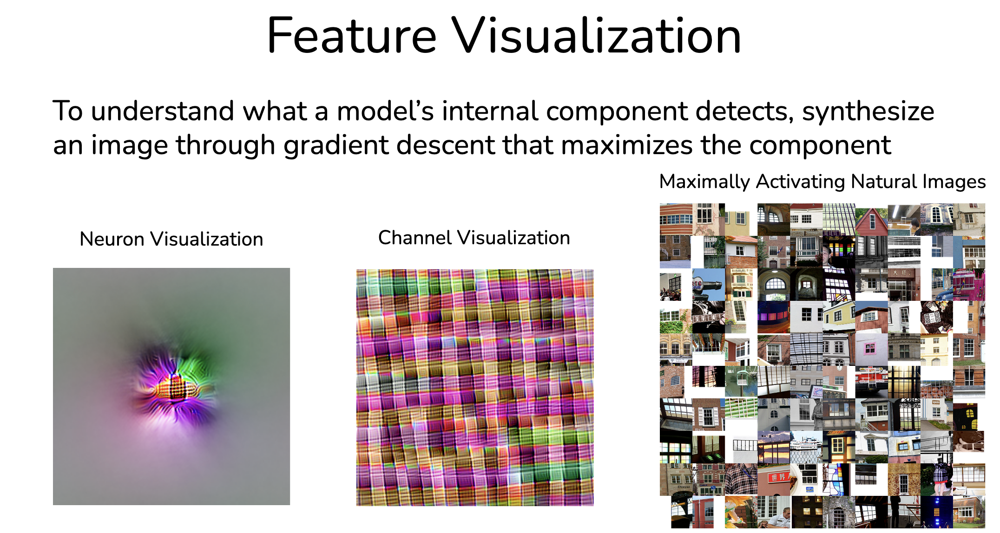

# Transparency
Contributor(s): Cody Rushing

## Why do Transparency Research?
Transparency tools can provide clarity about a model's inner workings. When models change, their internal representations can change as well. It's desirable to understand when models process data qualitatively differently.

Performance scores, alone, do not reflect properties of the model well. For instance, between StyleGAN3-R and StyleGAN2, they have different internal representations despite having similar downstream performance. When we can look inside networks, we can find helpful properties that we can't with just performance scores.

*Image from Karras, Tero, et al*

## Deception and Hazard detection

### Saliency Maps for Images
Saliency Maps highlight parts of inputs which are the most salient for the prediction. Using these, we're trying to capture what the model has learned.
- One way to get a saliency map is to find the gradient of an input (with respect to increasing the class logit). The parts of the input (pixels, here) which have the highest gradient can reflect what parts of the input are the most important!
- SmoothGrad aggregates across multiple saliency maps derived from inputs with Gaussian noise. This highlights what is salient across a variety of inputs, while having an additional benefit of being smoother.
- Another approach involves involves optimizing a mask to locate and blur salient regions.
- Guided BackProp applies backpropagation on an input while additionally zeroing out intermediate negative activations and gradients. (Not exactly intended to be a saliency map, but produces interesting looking images!)

There are many other saliency maps, but unfortunately, many of them don't pass basic sanity checks. One sanity check - if we randomize the layers and the saliency maps don't change much, it suggests the maps don't capture what the model has learned. As such, many transparency tools make fun-to-look-at visualizations which don't actually inform us about how the models work. Furthermore, some methods may be sensitive to hyperparameters

*Image from Adebayo, Julius.*

### Saliency Maps for Text
We can try to locate salient tokens - what tokens were the most important for the classification. One approach is to apply a saliency score is by calculating the magnitude of the gradient of the classifier's logit with respect to the token's embedding.

There isn't a canonical saliency map for text. Saliency maps for text are helpful for writing adversarial examples.
## Feature Visualization
The goal of feature visualization is to understand what a model's internal component detects. We can do this by synthesizing an image through gradient descent that maximizes said target component. For instance, if we want to 'visualize' a neuron, we attempt to generate an input which maximizes the neuron's activation. We also visualize Channels, as well (which are more informative)

*Image from OpenAI*

Furthermore, we can maximize the component with GANS, instead of using gradient descent!

Feature Visualization is not a perfect transparency tool, though. We can't always do channel visualization, and thus are sometimes confined to neuron visualization. Furthermore, natural, highly activating, images often explain ConvNet components better than feature visualizations.

## Other Approaches
We can also attempt to change the models themselves to make them more transparent. For instance, ProtoPNet changes the prediction pipeline to make models more transparent.

## Sources:
Adebayo, Julius. _Sanity Checks Saliency - Github Pages_. https://interpretable-ml-class.github.io/slides/Lecture_7_partb.pdf.
Hendrycks, Dan. “Transparency.” _YouTube_, YouTube, 1 Aug. 2022, https://www.youtube.com/watch?v=cqMe9E4p7fE.
Karras, Tero, et al. “Alias-Free Generative Adversarial Networks.” _ArXiv.org_, 18 Oct. 2021, https://arxiv.org/abs/2106.12423.
OpenAI. _OpenAI Microscope_, https://microscope.openai.com/models/resnetv2_50_slim/resnet_v2_50_block2_unit_3_bottleneck_v2_add_0/18.
